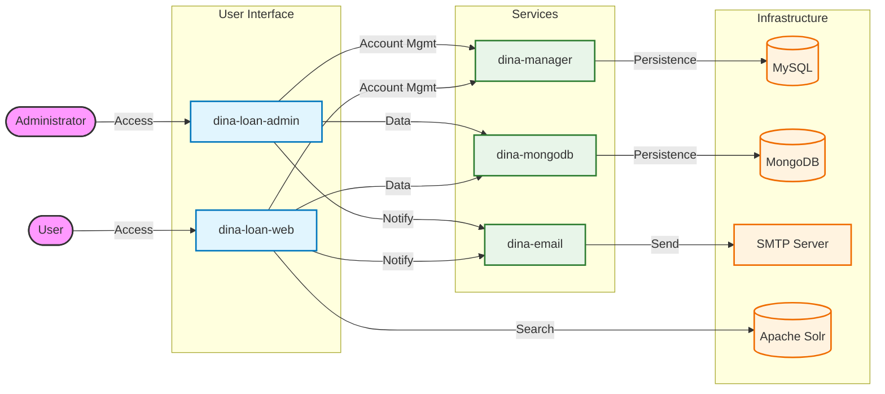

# Loan Management Application

## Overview
The Loan Management Application is a Java-based web application designed for managing loans at the Swedish Museum of Natural History (NRM). It utilizes a microservice-oriented architecture running on Thorntail (formerly WildFly Swarm).

## Technologies

*   **Java**: 8
*   **Build Tool**: Maven 3.x
*   **Application Server**: Thorntail 2.7.0.Final
*   **Web Framework**: JSF 2.1 (JavaServer Faces), PrimeFaces 7.0
*   **Persistence**:
    *   JPA (Java Persistence API)
    *   MongoDB (using `dina-mongodb` module)
    *   MySQL 8.0.33
*   **Search Engine**: Apache Solr 8.1.1
*   **Testing**: JUnit 4, PowerMock 2.0.9, Mockito 1.7.4

## System Architecture




## Project Structure

The project is organized into several Maven modules:

*   **`dina-loan-web`**: The main public-facing web application module (WAR).
*   **`dina-loan-admin`**: The administrative interface for managing loans (WAR).
*   **`dina-manager`**: Contains business logic and manager classes (EJB).
*   **`dina-email`**: Handles email notifications and services (EJB).
*   **`dina-mongodb`**: Integration layer for MongoDB interactions (EJB).

## Prerequisites

To run this project, ensure you have the following installed:

*   JDK 1.8
*   Maven 3.x
*   MongoDB Instance
*   MySQL Instance (compatible with 8.0.x)
*   Solr Instance (compatible with 8.1.x)

## Build Instructions

To build the entire project and install dependencies:

```bash
mvn clean install
```

## Running the Application

The application generates "uber-jars" via Thorntail which can be run directly.

### Public Web Application
After building, run the web application:

```bash
java -jar dina-loan-web/target/loan-thorntail.jar
```

### Admin Application
After building, run the admin application:

```bash
java -jar dina-loan-admin/target/loan-admin-thorntail.jar
```

## Docker Support

The project includes Docker support for the main web and admin applications.

### dina-loan-web
*   **Context**: `dina-loan-web/`
*   **Base Image**: `eclipse-temurin:8-jdk`
*   **Artifact**: `loan-thorntail.jar`
*   **Command**: Starts the application with `-Dmongohost=mongo` and `-Sinitdata`.

### dina-loan-admin
*   **Context**: `dina-loan-admin/`
*   **Base Image**: `eclipse-temurin:8-jdk`
*   **Artifact**: `loan-admin-thorntail.jar`
*   **Command**: Starts the application with `-Dmongohost=mongo` and `-Sinitdata`.

## Configuration

Configuration is primarily handled via `project-initdata-*.yml` files or internal configuration classes depending on the module. Ensure database connections and external service endpoints are correctly configured before running.
